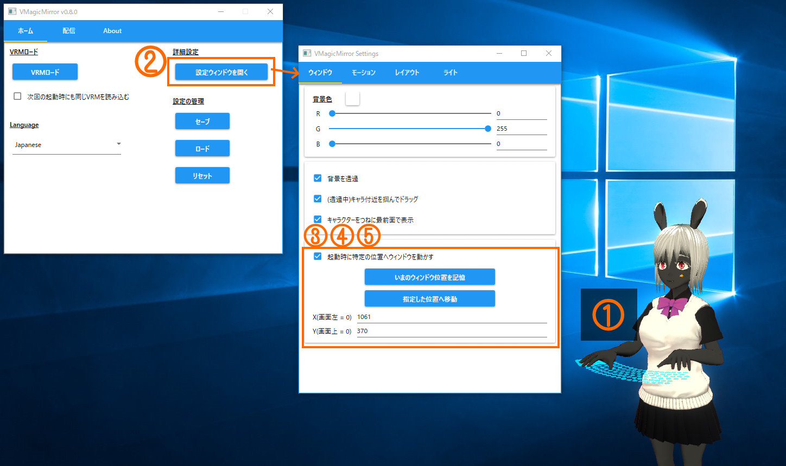

# 3. 詳細設定

コントロールパネルの`ホーム`タブで、`設定ウィンドウを開く`ボタンを押すと設定ウィンドウが開けます。

{: data-lightbox="img01_010"}

設定ウィンドウでは、コントロールパネルに表示していない調整用の機能をサポートしています。

* 3.1. `ウィンドウ`
    - キャラクター表示ウィンドウの制御
* 3.2. `モーション`
    - キャラクターの体型や動き方にあわせた調整
* 3.3. `レイアウト`
    - カメラ、キーボード、マウスパッド、ゲームパッドの配置
* 3.4. `ライト`
    - ライトとBloomの調整

## 3.1. ウィンドウ

`ウィンドウ`タブではキャラクター表示ウィンドウの背景が不透明なときの背景色や、最前面表示のオン・オフが切り替えられます。

また、`ウィンドウ`の設定項目ではアプリケーションの起動直後にキャラクターを表示する位置を固定できます。

セットアップ手順は次のとおりです。

{: data-lightbox="img01_015"}

1. [2: 基本的な使い方](./get_started.html)の手順に沿ってキャラクターを読み込み、好きな位置へ移動しておきます。
2. 設定ウィンドウの`ウィンドウ`タブを開いていることを確認します。
3. `起動時に特定の位置へウィンドウを動かす`チェックをオンにします。
4. キャラクターが所定の位置にいることを確認し、`いまのウィンドウ位置を記憶`ボタンを押します。
5. ボタンを押した結果、ボタンの下にある`X(画面左 = 0)`や`Y(画面上 = 0)`の欄に数値が入力されたことを確認します。

セットアップ後にVMagicMirrorを終了し、再度立ち上げると、セットアップした位置にキャラクターが表示されます。

もしキャラクターが表示されない場合、コントロールパネルの`ホーム`タブで、`次回の起動時にも同じVRMを読み込む`のチェックがオンになっているか確認してください。([2: 基本的な使い方](./get_started.html)の"2.2. キャラクターの表示"を参照下さい)

## 3.2. モーション

`モーション`タブではキャラクターの動き方や体型にかんする調整ができます。

{: data-lightbox="img01_018"}

### 3.2.1. 顔・表情

上部の項目はコントロールパネルの`配信`タブで`顔・表情`に表示されているのと同じ機能です。

最下部の`Funブレンドのデフォルト値[%]`は、キャラクターの表情をつねにやや笑顔に保つための設定値です。

大きくするほど基本の表情が笑顔になりますが、キャラクターによってはまばたきやリップシンクの動作と組み合わせたとき不自然になるため、その場合は小さな値にします。

### 3.2.2. 腕・ひじ

腕やひじの動かし方を設定します。

`脇をしめる幅 [cm]`と`脇をしめる強さ [%]`は、キャラクターが脇をしめたまま動くためのパラメータです。

`脇をしめる幅 [cm]`は、キャラクターの腰が太い場合は大きくし、細い場合は小さくします。

`脇をしめる強さ [%]`は、脇をしっかりしめてほしい場合、大きくします。大きすぎる値を指定すると、腕が体にめり込みやすくなることに注意してください。

以下は、デフォルトの設定、脇をきつくしめる設定、脇を開いた設定の例です。

{: data-lightbox="img01_020"}

{: data-lightbox="img01_030"}

{: data-lightbox="img01_040"}

`プレゼン動作サイズ[%]`は、`プレゼン風に右手を動かす`のチェックがオンのときの指さし動作の大きさを指定します。

モニターサイズに比べてキャラクターが小さい場合、この値を小さくすることで、腕が伸びっぱなしになるのを防ぎます。

逆に、モニターに対してキャラクターが大きかったり、キャラの手元を指し示したいときは、この値を大きくします。

`プレゼン動作の最小半径[cm]`は、指さし動作中に右手が胴体にめり込まないためのパラメータです。

大きな値にすると手が体にめり込みにくくなりますが、手元を指しにくくなり、腕が伸びがちになります。

### 3.2.3. 手・指

手や指の長さと、打鍵動作の大きさを調整します。

タイピング中の手の位置が大きくずれてしまう場合や、手がキーボードから浮きすぎる場合、調整してみてください。

**Hint:** 自然な動きに調整したのち、わざと`(打鍵後)手の高さ調整[cm]`の値だけを大きくすることで、大げさにタイピング動作するようにできます。

{: data-lightbox="img01_045"}

### 3.2.4. 待機モーション

待機モーションは呼吸動作に相当する動きです。

キャラクターによっては、動きを極端に大きくすると浮いて見えるかもしれません。

## 3.3. レイアウト

`レイアウト`タブではカメラ、キーボード、マウスパッド、ゲームパッドの配置を調整できます。

{: data-lightbox="img01_050"}

### 3.3.1. カメラ

コントロールパネルの`配信`タブにある`カメラ`と同じ機能です。

### 3.3.2. キーボード・マウスパッド

キーボードやマウスパッドの大きさ、高さを変更できます。キャラクターの体格に応じてサイズを変更してください。

### 3.3.3. ゲームパッド

キーボード・マウスパッドと同じく、ゲームパッドの高さや大きさ、表示・非表示を設定できます。

また、ゲームパッドのスティックを傾けるとキャラクターも傾きます。動作を確認する場合、デフォルト設定のまま左スティックを動かしてみて下さい。

* `キャラ傾き入力`でキャラクターが傾くスティックの種類を変更できます。
* `傾く方向を反転`のチェックをオンにすると、スティック入力と逆方向にキャラクターが傾きます。

なお、デフォルトではゲームパッドのキャプチャが有効ですが、ゲームパッドを使わない場合で、かつVMagicMirrorのCPU消費を少しでも抑えたい場合は`ゲームパッド入力のキャプチャを有効化`をオフにします。

## 3.4. ライト

`ライト`タブでは光やBloomについて色彩、強さを調整できます。

※VRMのキャラクターは`Unlit`系統のシェーダーが使われていることがあります。その場合、ライトを調整しても見た目が変わらないことに注意してください。

## Sections

* [1: VMagicMirrorについて](./index.html)
* [2: 基本的な使い方](./get_started.html)
* 3: 詳細設定 (このページ)
* [4: トラブルシューティング](./troubleshooting.html)
* [Tips A: デスクトップマスコット化のための設定](./tips_desktop_mascot.html)
* [Tips B: プレゼンテーションでVMagicMirrorを使う](./tips_presentation.html)
* [License](./about_license.html)
