# 3. Settings

[Japanese](./about_settings.html)

Setting Window is available from `Open Setting Window` on `Home` tab in control panel.

[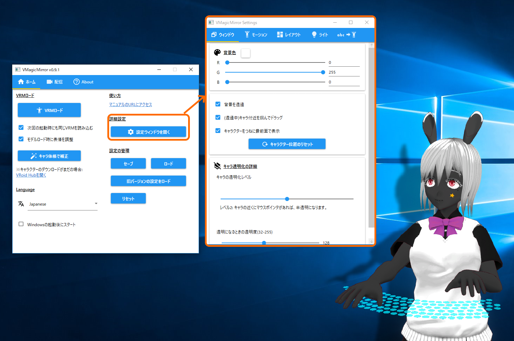](./images/about_settings/img01_010_setting_window.png){: data-lightbox="img01_010"}

Setting Window supports detailed customization options.

* 3.1. `Window`
    - Character window control
* 3.2. `Motion`
    - Adjust character size related parameters and motion scale
* 3.3. `Layout`
    - Layout of the camera, keyboard, mouse pad, and gamepad
* 3.4. `Effects` (*`Light` tab for the v0.9.2 or older version)
    - Light, shadow, bloom, and wind
* 3.5. `Word to Motion`
    - The feature to move the character face and motion by word input
    

## 3.1. Window

`Window` tab supports BG color when the character window is not transparent, and also can toggle whether the window is always foreground or not.

`Character Transparency Support` can customize when your character is semitransparent and when is opaque.

In default, the character becomes semitransparent during the mouse pointer is onto the character, so that you character does not disturb what exist behind her/him. You can also change the condition by changing sliding `Transparency Level`. For example, level 0 means always NOT transparent, which is older version's behavior.

**Note:** From v0.8.1, the character position is automatically saved, so when you quit the application and restart, the character will appear at the same place as previous time.

**Hint:** When you lost where the character is, then turning off `Transparent Window` and pressing `Reset Character Position` might be a help.

## 3.2. Motion

`Motion` tab can adjust character's proportion and motion related parameters.

[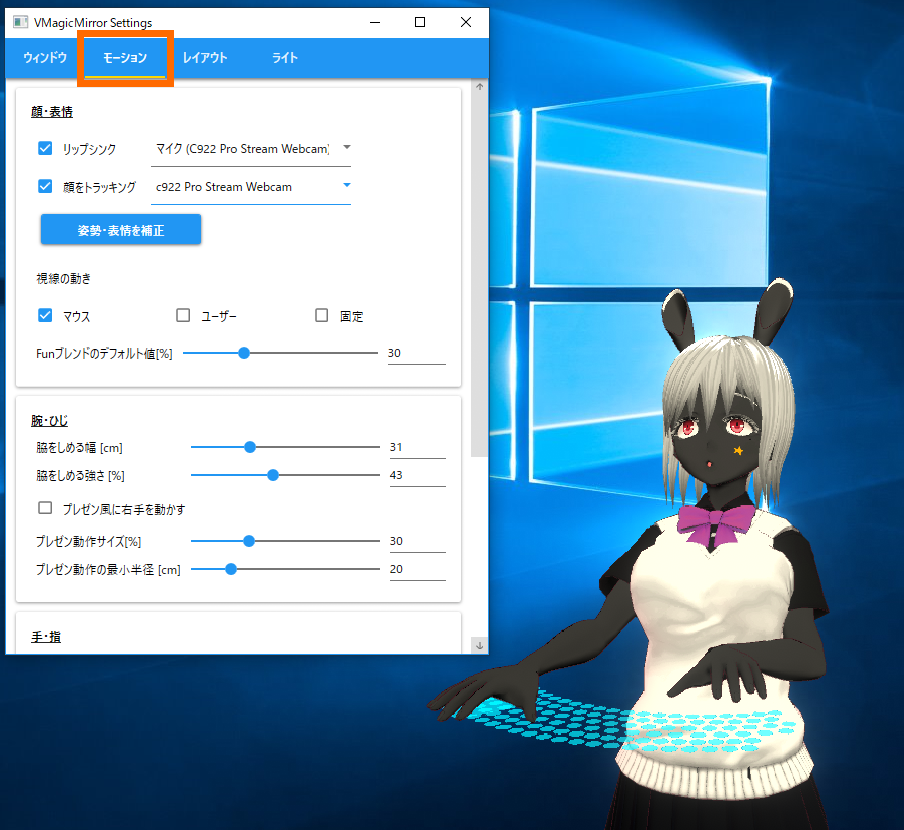](./images/about_settings/img01_018_motion_tab.png){: data-lightbox="img01_018"}

### 3.2.1. Face

Upper part is almost the same as `Streaming` tab in control panel, and additional check `Auto blink during face tracking` is also available.

The item `Default Fun Blend Shape [%]` specifies the default fun expression rate.

As the value increases the character will become always smile, but some character's facial expression will be unnatural when combined to blink or other face motions. In those cases, decrease the value.

The `Eyebrow (Open to Customize)` is very advanced section and normally you do not need modify them. However if you have original VRM and want to move the eyebrow, or in case the eyebrow motion is too big or too small. 

* This section requires the knowledge about `BlendShape` to control VRM facial expression. If you do not know well, please refer to [Virtual Cast Wiki](https://virtualcast.jp/wiki/doku.php?id=%E3%83%A2%E3%83%87%E3%83%AB%E4%BD%9C%E6%88%90:%E3%83%96%E3%83%AC%E3%83%B3%E3%83%89%E3%82%B7%E3%82%A7%E3%82%A4%E3%83%97%E8%A8%AD%E5%AE%9A) and see latter section's image. You will see the name like `mouth_a` or `mouth_b`. This is BlendShape. And you can specify the name of BlendShape to move eyebrow, by sliding each shape in Unity Editor.

### 3.2.2. Arm

Setup how to move the arm.

If you turn off `Enable Typing / Mouse Motion`, the the avatar stop to react to typing, mouse pointer move, or gamepad input. If you want to set the avatar always simply standing, turn off this checkbox.

`Waist width [cm]`and `Strength to keep upper arm to body [%]` are the parameters to keep the elbow close to body(, which is subtle but critical for the cute motion).

Please see the following example of default value, close elbow strongly, and open.

[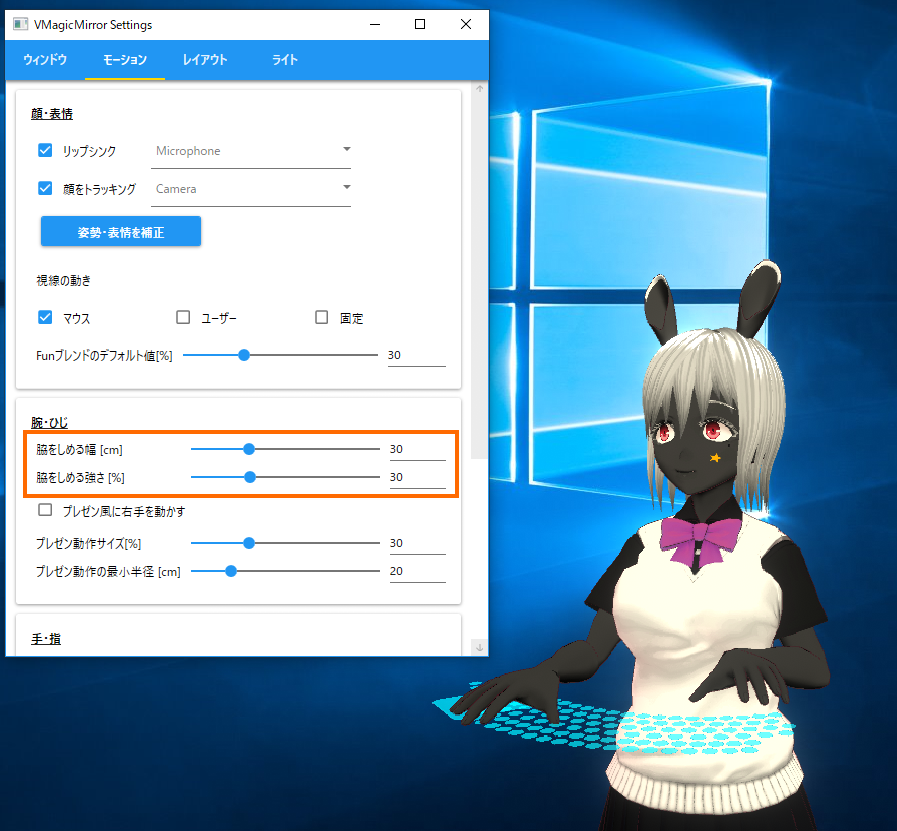](./images/about_settings/img01_020_arm_side_default.png){: data-lightbox="img01_020"}

[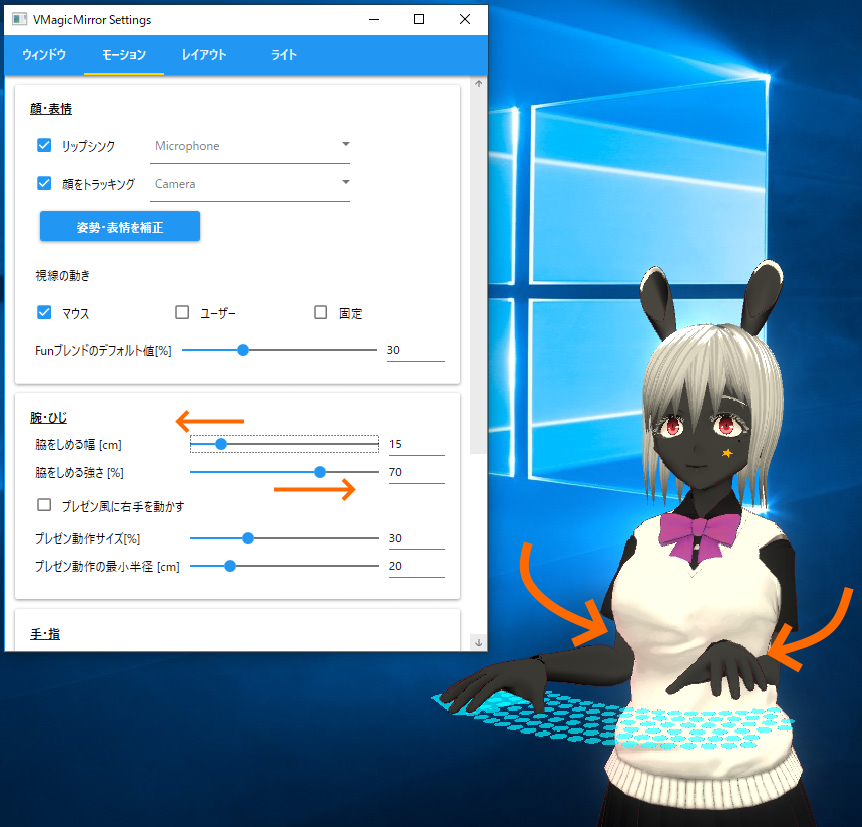](./images/about_settings/img01_030_arm_side_close.png){: data-lightbox="img01_030"}

[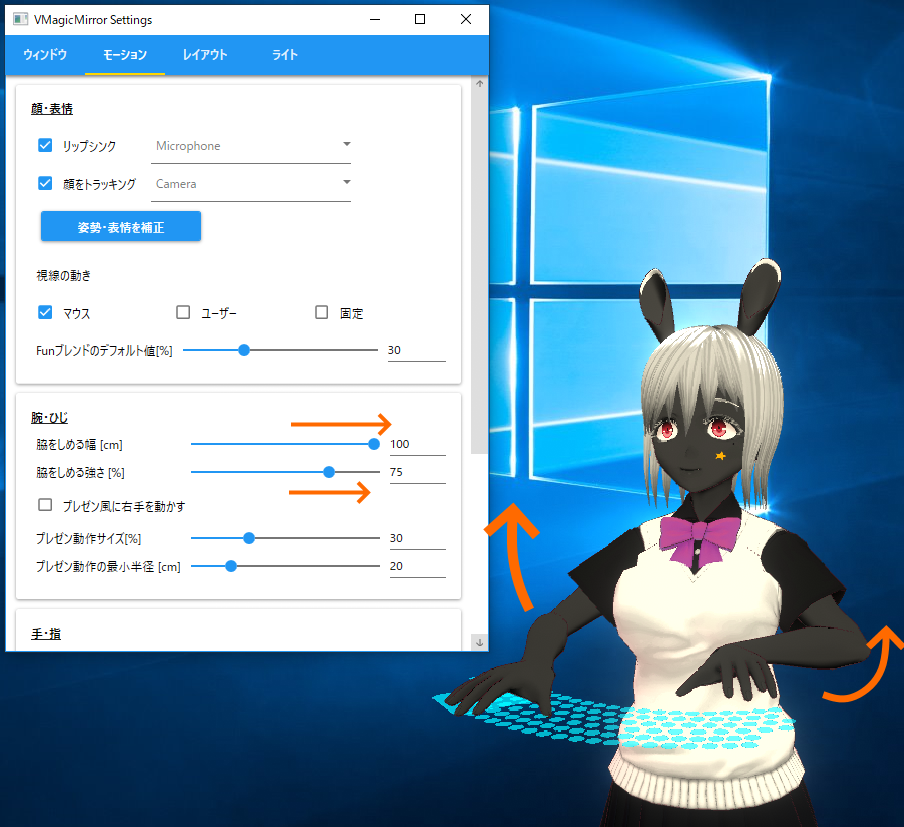](./images/about_settings/img01_040_arm_side_open.png){: data-lightbox="img01_040"}

`Show Pointer Support` toggles whether the circle shaped mouse emphasize indication should be visible or not.

`Presentation-like motion scale [%]` has effect during `Presentation-like hand` check is on.

The value should be small when the character is enough small compared to the whole monitor size to avoid the right arm always stretched, or vise versa.

`Arm position radius min [cm]` helps to avoid arm going into the body, when large value is set. However too large value makes the arm always stretched.

### 3.2.3. Hand

Parameters about hand or finger length and typing motion.

Check those values when the typing motion is done far from the keyboard, or the hand is too float above the keyboard.

**Hint:** After setup natural motion, set large value to `(Press key) Hand height adjust [cm]`, which make comical big typing motion.

[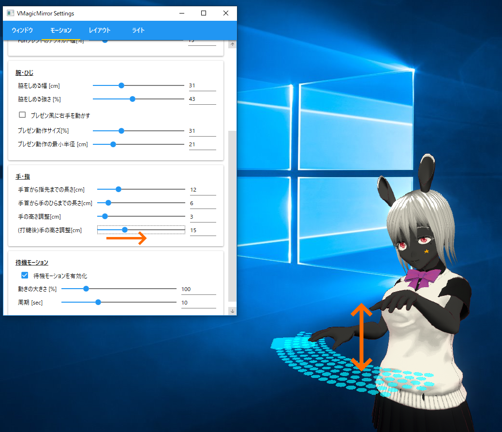](./images/about_settings/img01_045_large_type_motion.png){: data-lightbox="img01_045"}

### 3.2.4. Wait motion

Wait motion is breathing like motion.

It might be helpful for some characters to show as if (s)he is floating, with large `Scale [%]` and short `Period [sec]`.

## 3.3. Layout

In `Layout` tab you can access to the parameters to adjust surrounding device layout like camera, keyboard, gamepad, etc.

[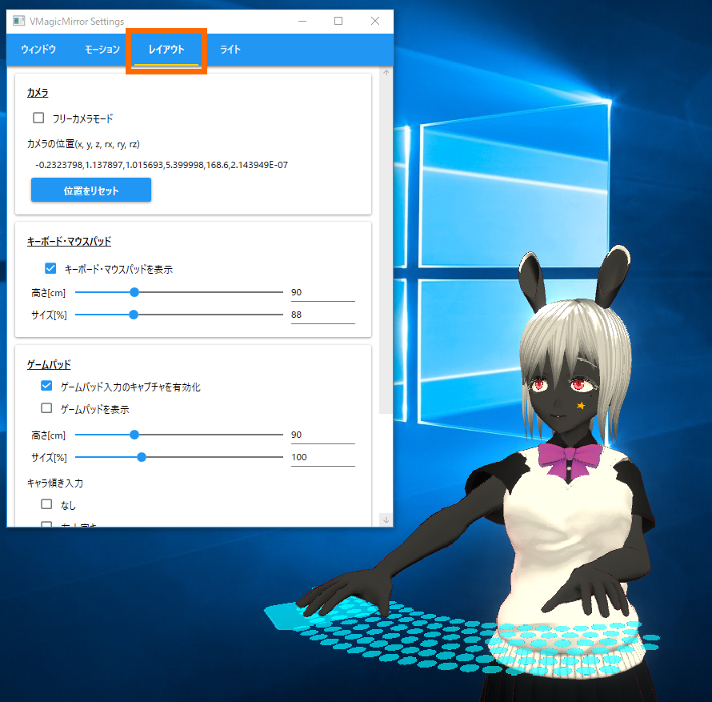](./images/about_settings/img01_050_layout_tab.png){: data-lightbox="img01_050"}

### 3.3.1. Camera

Almost same as `Camera` menu in control panel `Streaming` tab.

In this panel you can also adjust FOV (Field of View).

### 3.3.2. Device Layout

Same as `Streaming` tab in control panel.

Available from v0.9.5.

### 3.3.3. Keyboard

You can change the size and height of the keyboard and mouse pad, along to your character's scale.

This panel also supports the selection of typing effect, as control panel `Streaming` tab.

### 3.3.4. Gamepad

For v0.9.4 or older version, adjust height and size here.

Gamepad has the feature that the character leans by  stick input. If you have a gamepad, let's check it by moving left stick with default setting!

*In v0.9.0, gamepad is always disappeared.

* In `Lean by stick` list you can select what stick (or direction key) the character should be react.
* `Reverse direction to lean` support to lean reversed direction.

**NOTE:**

In default the gamepad feature is available, but if you do not use it, and the VMagicMirror performance is not good on your machine, then check off `Enable Input Capture` on the top of `Gamepad` menu.

## 3.4. Effects

`Effects` tab supports light, shadow, bloom and wind settings.

Light and shadow has separated orientations, so you can set the light orientation simply for the avatar's looking, while adjust shadow orientation to show it on the back of the avatar.

Also you can adjust the depth offset and orientation of the shadow to , so that your avatar looks near or far to the screen.

Default setting : 

[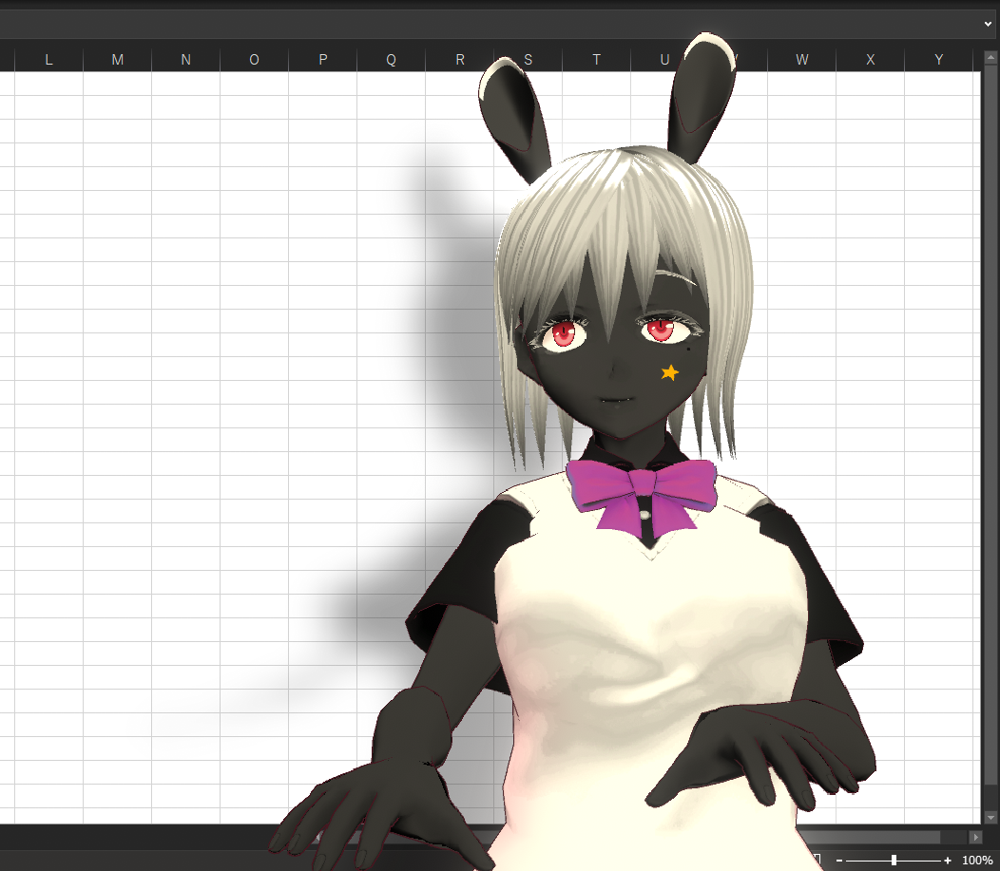](./images/about_settings/img01_070_shadow_depth_default.png){: data-lightbox="img01_070"}

Example to show distance between screen and the character : 

[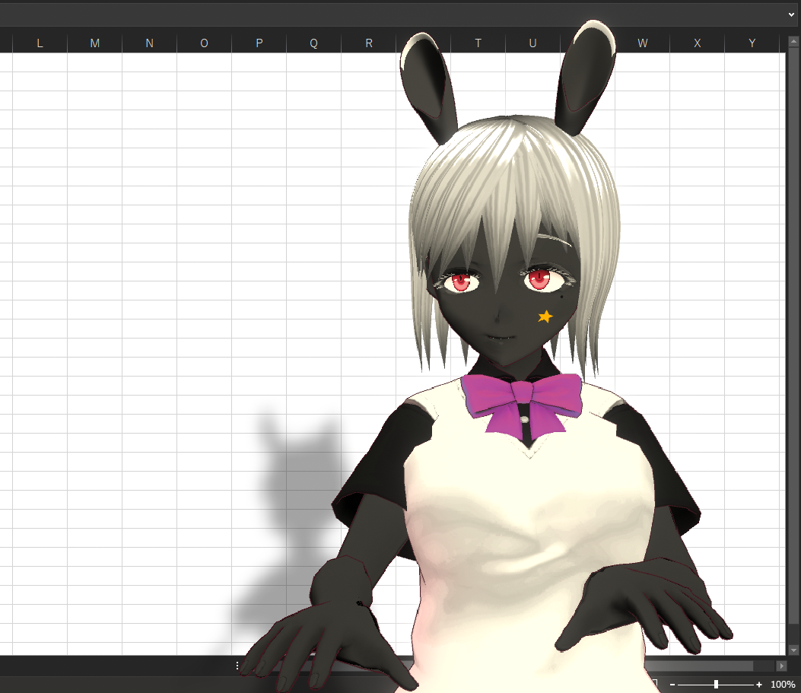](./images/about_settings/img01_080_shadow_depth_look_far.png){: data-lightbox="img01_080"}

**NOTE:** Please be aware that some VRM character uses `Unlit` type shader, to which the light setting has no effect.

For the wind settings:

* Please setup `VRMSpringBone` beforehand, to enable wind-based motion.
* Wind feature moves all `VRMSpringBone` components, so "only hair (not skirt)" like setting is not supported.

## 3.5. Word to Motion

From v0.9.0 `Word to Motion` is supported. `Word to Motion` is the function to receive word input to change the character's face expression or start built-in motion.

[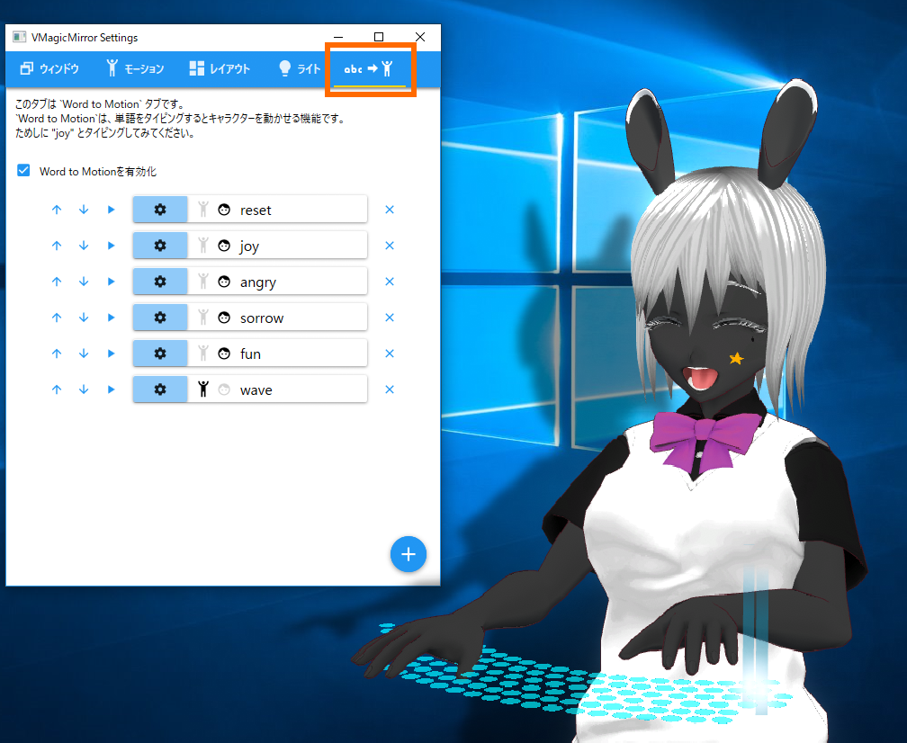](./images/about_settings/img01_100_word_to_motion_tab.png){: data-lightbox="img01_100"}

This feature sometimes make your avatar unnatural. In those case, please turn off `Enable Word to Motion` check.

`Word to Motion` consists of word items to define what word to react, and how to react to the word.

You can test how each item work by typing word, or press `Play` button at the left of each item. For example, the above picture shows the case after typing "joy".

**NOTE:** During typing those word, please be careful NOT to insert any control key (Shift, Control, Alt, etc.). Also there are cases the word is not recognized for the too slow typing.

From v0.9.1, gamepad is also supported. Turn on `Use gamepad as launcher` and press buttons in left column to start motion or face expression.

{: data-lightbox="img01_105"}

The example above shows starting `fun` expression by `Y` button.

**NOTE:** `Use gamepad as launcher` disables gamepad based hand motion. If you prefer to use VMagicMirror for game play streaming, please turn off `Use gamepad as launcher`.

`Up` and `Down` supports re-order of items. Delete button at the right side removes selected item.

You can add and custom the word and reaction for the word by 4 steps.

* Step 1: Press `+` button to add a new item. If you custom existing item, skip it.
* Step 2: Press `Setting` button to open the setting.
* Step 3: In the custom window you can setup motion and face blend shape.
* Step 4: Press `OK` to reflect your customize.

[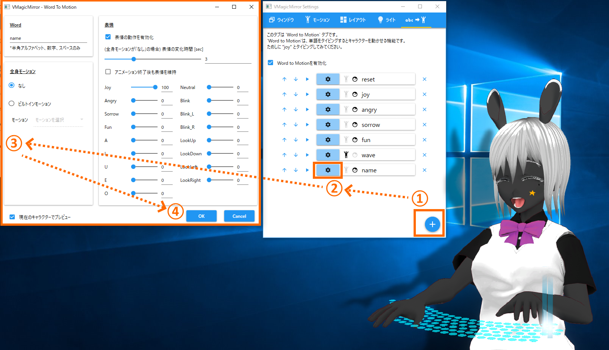](./images/about_settings/img01_110_word_to_motion_custom_flow.png){: data-lightbox="img01_110"}

Custom window interface is as following.

[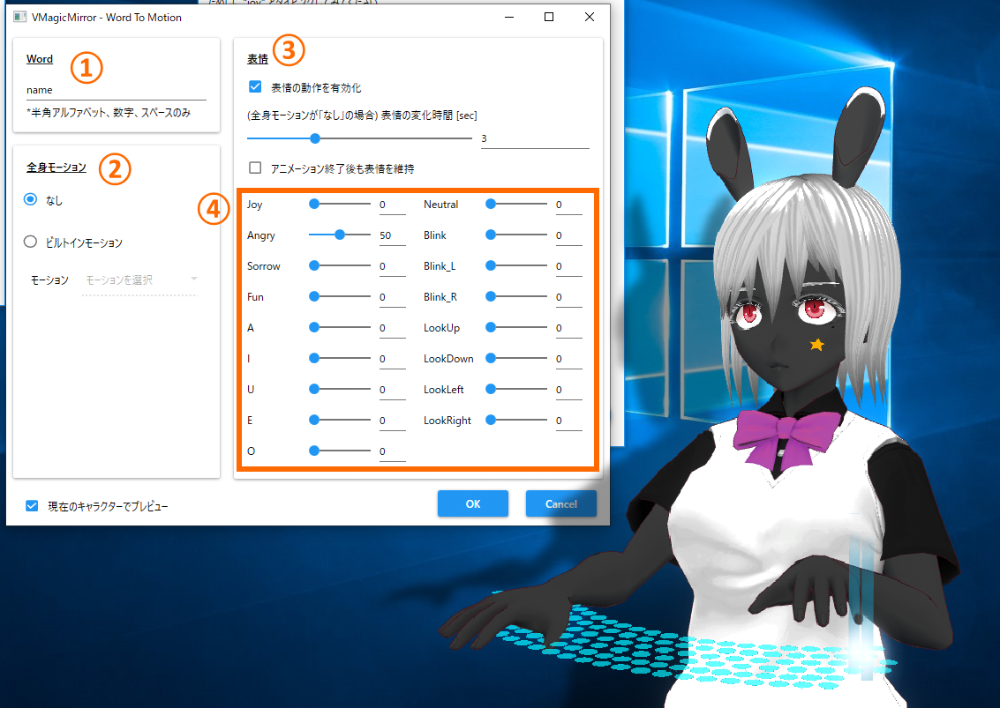](./images/about_settings/img01_120_word_to_motion_custom_window.png){: data-lightbox="img01_120"}

* 1: Set the word to start this item. 
* 2: Select motion type for this item. 
    * **NOTE:** In v0.9.0 only 2 built-in motions are supported, so in almost case you will select `None` option.
* 3: Facial expression setting.
    * Turn on `Enable Face Expression` check to play some face expression in this item.
    * `Duration when Body Motion is None [sec]` defines how long the character keep the face.
    * If `Keep face after motion` is on, then character face does not change after the duration.
* 4: BlendShapes. 
    * **NOTE:** In the most cases you should set only one blend shape to non-zero for the appearance.

**Hint:**

When you use the expression with `Keep face after motion` option you will need reset motion.

Reset item will be like following, which has all-zero face expression with very short duration.

[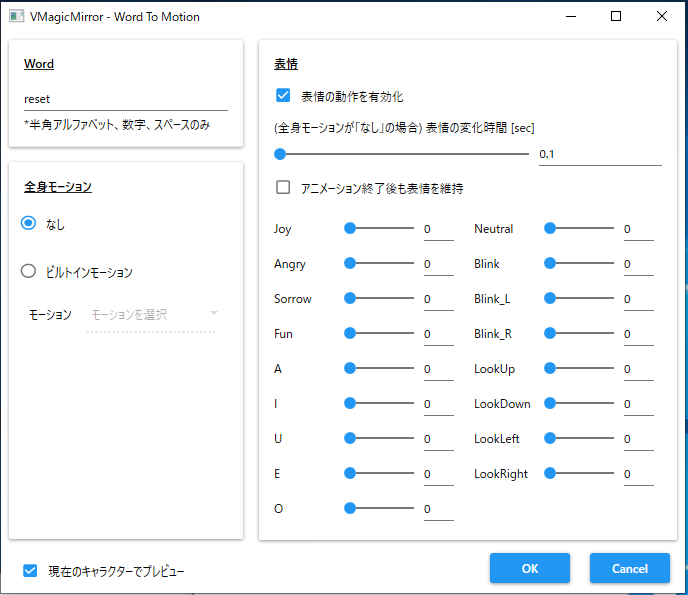](./images/about_settings/img01_130_word_to_motion_reset_tips.png){: data-lightbox="img01_130"}

## 3.6. Reset Settings to default

v0.9.2 or later version support to reset each settings, by clicking `Reset` button at the top on almost every category in setting window.

Below is an example to reset light settings to default.

[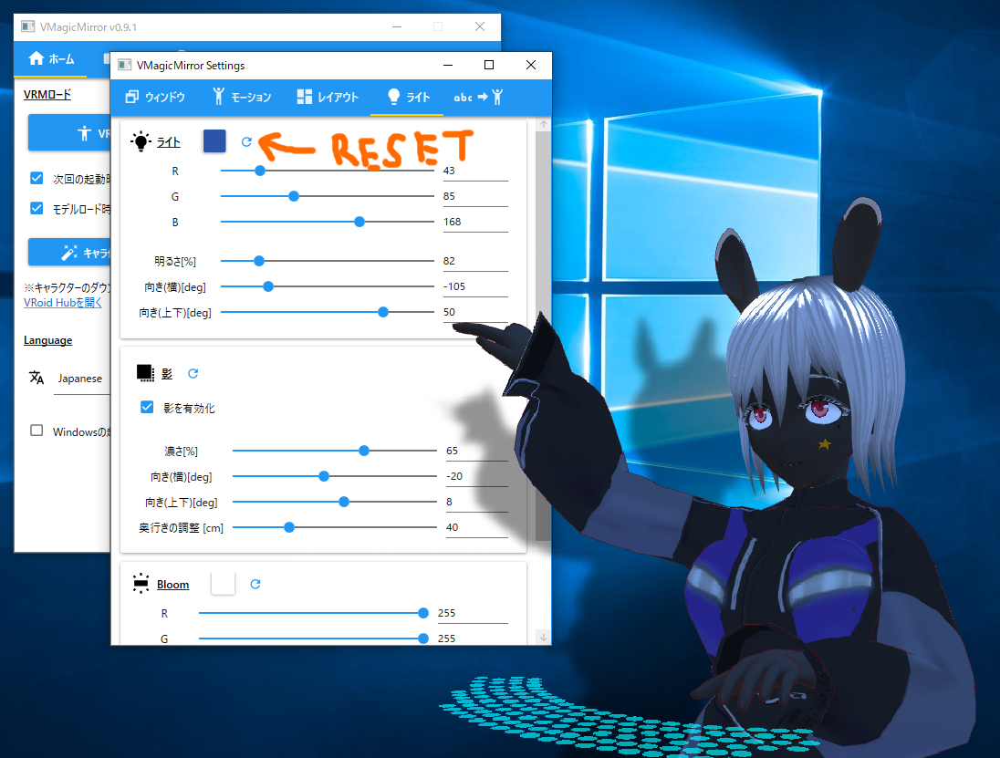](./images/about_settings/img01_140_reset_setting_before.png){: data-lightbox="img01_140"}

{: data-lightbox="img01_150"}

## Sections

* [1: VMagicMirror](./en_index.html)
* [2: Getting Started](./en_get_started.html)
* 3: Settings (this page)
* [4: Troubleshooting](./en_troubleshooting.html)
* [Tips A: Desktop Mascot Setup](./en_tips_desktop_mascot.html)
* [Tips B: VMagicMirror for Presentation](./en_tips_presentation.html)
* [Tips C: Load Previous Version Setting](./en_tips_load_prev_setting.html)
* [Tips D: Change Device Textures](./en_tips_change_textures.html)
* [License](./en_about_license.html)
* [Change Log](./en_changelog.html)
* [FAQ](./en_frequently_asked_questions.html)
