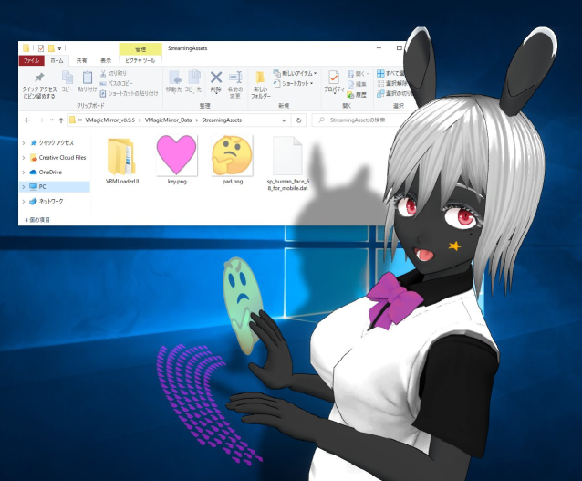

# Tips D: Change Device Textures

[Japanese](./tips_change_textures.html)

note: this feature will be fully supported in v0.9.6, but older version also supports it partially so the maintainer has written this tips.

VMagicMirror can load custom texture for the keyboard's key, or touch pad. In v0.9.5 only `png` image is available.

Before starting `VMagicMirror.exe`, open the following folder.

`(Folder where VMagicMirror.exe exists)/VMagicMirror_Data/StreamingAssets`

Put the images to replace in this folder. File name must be following.

* For the keyboard key image: `key.png`
* For the touch pad: `pad.png`

You can put both image, or only one image.

After the setup, start `VMagicMirror.exe` to load the specified image.

{: data-lightbox="img_tips_10"}

When you want to recover the setting as default, remove `key.png` and `pad.png`.

## Known issue

In v0.9.4 and v0.9.5, the image is flipped when seen from opposite side, for keyboard and touch pad.

This issue will be fixed in v0.9.6.

## Sections

* [1: VMagicMirror](./en_index.html)
* [2: Getting Started](./en_get_started.html)
* [3: Settings](./en_about_settings.html)
* [4: Troubleshooting](./en_troubleshooting.html)
* [Tips A: Desktop Mascot Setup](./en_tips_desktop_mascot.html)
* [Tips B: VMagicMirror for Presentation](./en_tips_presentation.html)
* [Tips C: Load Previous Version Setting](./en_tips_load_prev_setting.html)
* Tips D: Change Device Textures (This Page)
* [License](./en_about_license.html)
* [Change Log](./en_changelog.html)
* [FAQ](./en_frequently_asked_questions.html)
