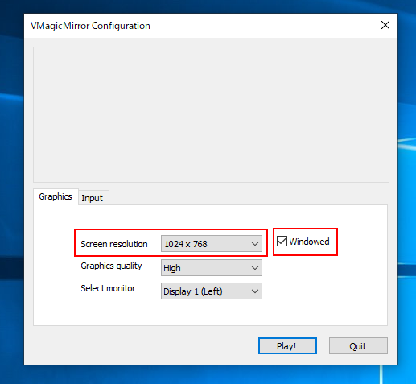

# 1: キャラクターを読み込んで動かす

## VMagicMirrorの開始と終了

`VMagicMirror.exe`を起動します。

起動の際に解像度などを聞かれるので、以下を確認して`Play!`を選択します。

* `Windowed`にチェックが入ってること
* `Screen Resolution`にモニターサイズよりも十分小さい解像度が指定されている事

起動すると、GUIがある「コントロールパネル」と、キャラクターが映る「キャラクター表示ウィンドウ」が立ち上がります。

コントロールパネルかキャラクター表示ウィンドウの一方を閉じると、もう片方の画面も閉じてVMagicMirrorが終了します。

「キャラクターは表示したいがコントロールパネルは隠したい」という場合、コントロールパネルを最小化します。

## キャラクターの表示

コントロールパネルの`ホーム`タブ内にある`VRMロード`ボタンを押し、PC上の`.vrm`ファイルを選択します。

キャラクターを選択すると、キャラクター表示ウィンドウに規約が表示されます。

確認して問題なければ`OK`をクリックすると、キャラクターが表示され、マウスやキーボードの操作に応じて動きます。

同じキャラクターを次回以降も使いたい場合、`VRMロード`ボタンの下にある、`次回の起動時にも同じVRMを読み込む`のチェックをオンにします。

**Hint:** キャラクターによってはキーボードやマウスの位置がキャラクターの体型からずれていますよね？もしそうであれば、順に[2: 詳細設定](./about_settings.html)

## 配信タブ

コントロールパネルの`配信`タブではVMagicMirrorのすべての主要機能にアクセスできます。

VRMをロードしたら、各機能を試してみましょう。

### ウィンドウ

`ウィンドウ`で、`背景を透過`のチェックをオンにすることで、キャラクター表示ウィンドウの背景を透明にできます。VMagicMirrorは通常、この状態で使用します。

背景を透明にしたとき、`(透過中)キャラ付近を掴んでドラッグ`のチェックがオンになっていれば、キャラクター付近を左クリック+ドラッグしてキャラクターを移動できます。

ただし、`(透過中)キャラ付近を掴んでドラッグ`がオンのままだとキャラクターを誤って移動させたり、キャラクター背後のアプリケーションにアクセスできなくなったりします。

これを防ぐには、キャラクターを移動させたあとで`(透過中)キャラ付近を掴んでドラッグ`のチェックをオフにします。

すると、キャラクター表示ウィンドウがクリックに反応しなくなり、背後のウィンドウにもアクセスできます。

**Hint:** VMagicMirrorでは、起動時にいつも同じ場所へキャラクターを配置することもできます。([Tips 1: 表示位置を固定する](./tips_fix_position.html))

### 顔・表情

`顔・表情`メニューはその名の通り、顔の動きに関連する主要な機能です。

#### リップシンク

`リップシンク`はマイクを使用する機能です。このチェックをオンにし、右のマイク一覧から使いたいマイクを選ぶと、リップシンクが有効になります。

#### 顔トラッキング

`顔をトラッキング`ではウェブカメラが必要です。リップシンクと同様に、`顔をトラッキング`のチェックをオンにし、右の一覧からウェブカメラを選ぶことで、顔トラッキングが有効になります。

もしあなたの顔がカメラの正面から上下左右にずれていたり、カメラとの距離が近い、または遠い場合はキャラクターの姿勢がおかしくなるかもしれません。

その場合、普段の姿勢で画面を見つめて目を開き、`姿勢・表情を補正`ボタンをクリックします。補正に成功すると、キャラクターが中央に戻ります。

**Hint:** キャラクターの目が閉じがちになってしまう場合、目を半閉じにして`姿勢・表情を補正`ボタンをクリックすると、目が開きやすくなります。似たように、キャラクターがうつむきがちになる場合は、少し下を向いて`姿勢・表情を補正`ボタンをクリックすると、キャラが上を向くようになります。

#### 視線の動き

VMagicMirrorの基本設定では、キャラクターがマウスポインタの方向を向きます。

これは作業配信やプレゼンテーションを想定したデフォルト設定ですが、都合によっては他のモードを選ぶこともできます。

* マウス: キャラクターはマウスポインタの方向を向きます。デフォルト設定です。
* ユーザー: キャラクターは常にあなたの方向を向きます。マウスの動きが激しすぎる場合などに使用します。
* 固定: 顔トラッキングのみで首を動かすようにします。動きをおさえたい場合に使用します。

### 表示

`表示`から`キーボード・マウスパッド`や`ゲームパッド`のチェックのオン・オフを切り替えることで、これらの要素を表示するか隠すかを選択できます。

### カメラ

`フリーカメラモード`を用いるとカメラの視点を変更し、自由な方向からキャラクターを見られます。

本機能を使うときは、いったん`ウィンドウ`メニューの`背景を透過`をオフにします。

`フリーカメラモード`のチェックをオンにし、キャラクター表示ウィンドウを左クリックしてアクティブにします。

キャラクター表示ウィンドウがアクティブな間、いくつかの方法で視点を動かせます。

* 右クリック + ドラッグ : 視線を上下左右に回転
* 中クリック + ドラッグ : カメラを上下左右に平行移動
* 中ホイール : カメラを前後に移動

キャラクターを見失った場合や、始めからやり直したい場合は、`位置をリセット`ボタンで初期状態に戻せます。

調整が終わったら`背景を透過`をふたたびオンにします。

また、`フリーカメラモード`も有効なままにすると誤ってカメラを動かしてしまう場合があるため、`フリーカメラモード`のチェックもオフにしておきます。

**Hint:** 操作に慣れてきたら、`背景を透過`をオンにしたままでも`フリーカメラモード`を使えます。

* `(透過中)キャラ付近を掴んでドラッグ`をオンにする
* キャラクターを左クリックする
* 右クリック、中クリック、ホイールで視点を調整
* キャラクターを動かしたくない場合、調整が終わりしだい`(透過中)キャラ付近を掴んでドラッグ`をオフにする

※`背景を透過`をオンにしたまま`フリーカメラモード`を用いると、気づかないうちにキャラクターがキャラクター表示ウィンドウから見切れることがあります。キャラクターが見切れてよく分からなくなってしまった場合は`位置をリセット`ボタンを押してやり直す、`背景を透過`をオフにしてウィンドウの位置を確認します。

### モーション

`プレゼン風に右手を動かす`のチェックをオンにしてマウスを動かすと、キャラクターが右手でマウスポインタの方向を指し示します。

このスタイルは解説動画やプレゼンテーションでVMagicMirrorを使うときに有効です。

このモードを終了するときは`プレゼン風に右手を動かす`のチェックをオフにします。

**Hint:** 詳しくは[Tips 3: プレゼンテーションでVMagicMirrorを使う](./tips_presentation.html)もあわせてご覧下さい。

## もっと細かく調整したい方へ

ここまで動かしてみて、キャラクターの見栄えに気になる点があった方もいると思います。

* キーボードの位置がキャラクターに比べて高すぎ・低すぎ
* キャラクターが明るすぎる・暗すぎる

[2: 詳細設定](./about_settings.html)を読み進めて項目を見ていくと、上記の問題を解決でき、より個々のキャラクターにあった動かし方が実現できます。

しっかりと調整してみたい方はぜひ続けてお読みください。

## マニュアル一覧

* [VMagicMirror](./index.html)
* 1: キャラクターを読み込んで動かす (このページ)
* [2: 詳細設定](./about_settings.html)
* [3: トラブルシューティング](./troubleshooting.html)
* [Tips 1: 表示位置を固定する](./tips_fix_position.html)
* [Tips 2: デスクトップマスコット化のための設定](./tips_desktop_mascot.html)
* [Tips 3: プレゼンテーションでVMagicMirrorを使う](./tips_presentation.html)
