# 2: 基本的な使い方

[English](./en_get_started.html)

※最小限のセットアップ手順は以下の動画でも紹介しています。大まかな流れだけ確認したい場合、こちらの動画に沿った手順でもセットアップが可能です。

<iframe width="560" height="315" src="https://www.youtube.com/embed/PFalrIig-RM" frameborder="0" allow="accelerometer; autoplay; encrypted-media; gyroscope; picture-in-picture" allowfullscreen></iframe>

## 2.1. VMagicMirrorの開始と終了

`VMagicMirror.exe`を起動すると、GUIがある「コントロールパネル」と、キャラクターが映る「キャラクター表示ウィンドウ」が立ち上がります。

[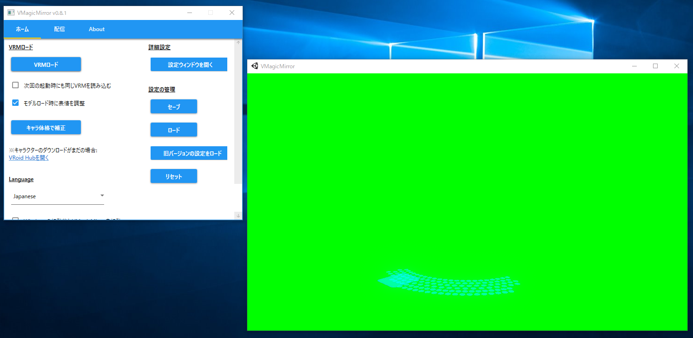](./images/get_started/img00_015_started.png){: data-lightbox="img00_015"}

コントロールパネルかキャラクター表示ウィンドウの一方を閉じると、もう片方の画面も閉じてVMagicMirrorが終了します。「キャラクターは表示したいがコントロールパネルは隠したい」という場合、コントロールパネルを最小化します。

## 2.2. キャラクターの表示

<iframe 
    width="560" 
    height="315" 
    src="https://www.youtube.com/embed/I-CHfCHbjx8?autoplay=1&loop=1&playlist=I-CHfCHbjx8" 
    frameborder="0" 
    allow="accelerometer; autoplay; encrypted-media; gyroscope; picture-in-picture" 
    allowfullscreen>
</iframe>

コントロールパネルの`ホーム`タブ内にある`VRMロード`ボタンを押し、PC上の`.vrm`ファイルを選択します。

[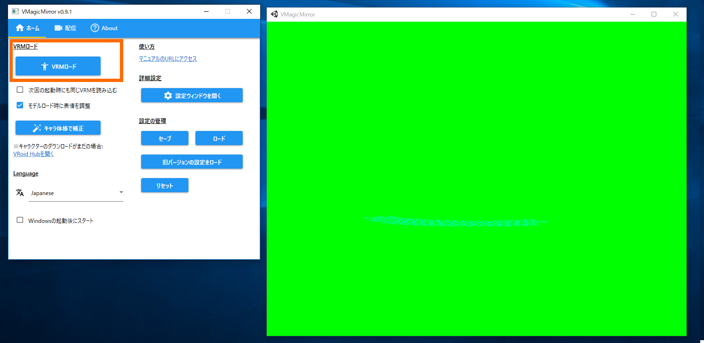](./images/get_started/img00_020_load_vrm.png){: data-lightbox="img00_020"}

キャラクターを選択すると、キャラクター表示ウィンドウに規約が表示されます。

[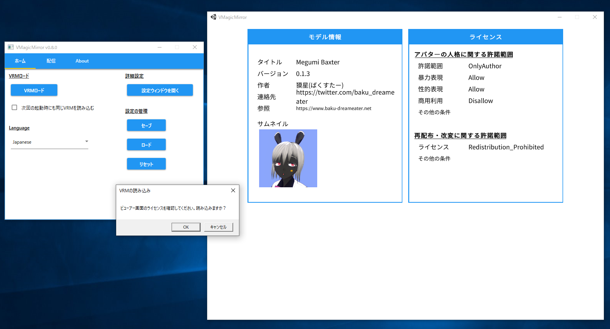](./images/get_started/img00_030_load_vrm_confirmation.png){: data-lightbox="img00_030"}

※規約が表示されない場合、セキュリティソフトが原因の可能性があります。セキュリティソフトを無効化してみてください。

確認して問題なければ`OK`をクリックすると、キャラクターが表示され、マウスやキーボードの操作に応じて動きます。

同じキャラクターを次回以降も使いたい場合、`VRMロード`ボタンの下にある、`次回の起動時にも同じVRMを読み込む`のチェックをオンにします。

[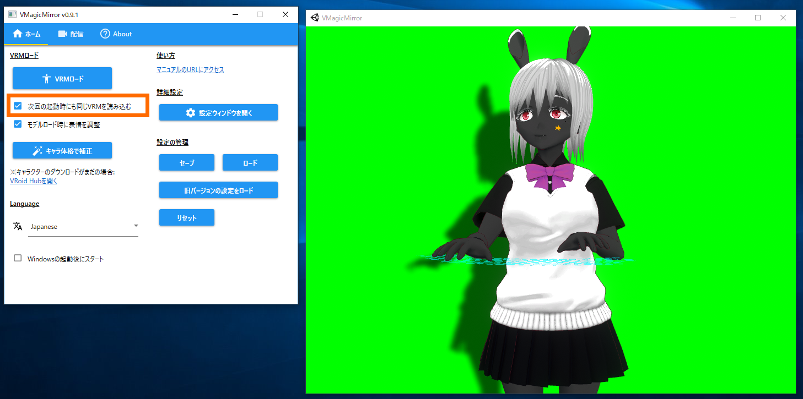](./images/get_started/img00_040_after_loaded.png){: data-lightbox="img00_040"}

**Hint:** キーボードやマウスの位置がキャラクターの体型と合わない場合は、`キャラ体格で補正`ボタンを押すことでレイアウトが調整できます。

[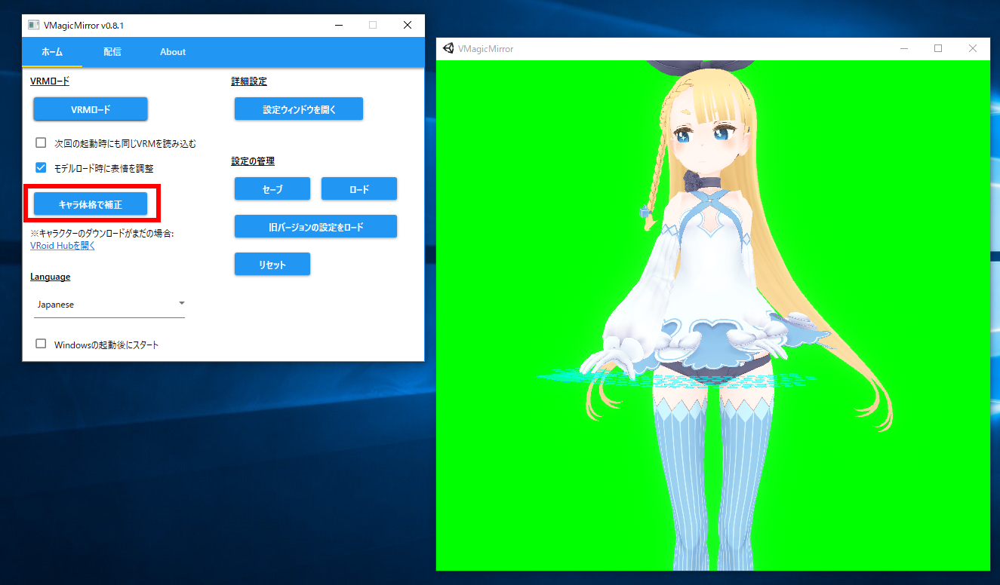](./images/get_started/img00_160_not_good_layout_example.png){: data-lightbox="img00_160"}

[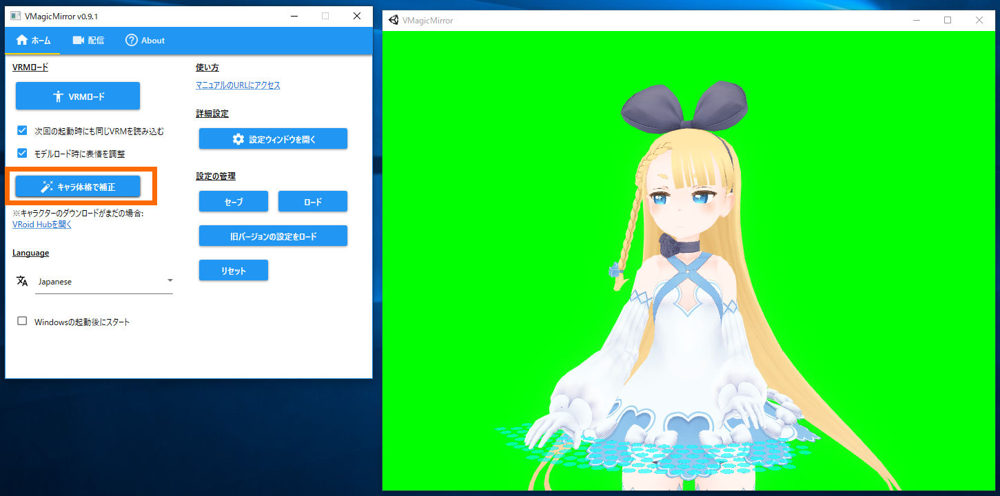](./images/get_started/img00_170_after_adjust.png){: data-lightbox="img00_170"}

さらに調整する場合は、順に読み進めて[3: 詳細設定](./about_settings.html)のなかで調整できます。

## 2.3. 配信タブ

コントロールパネルの`配信`タブではVMagicMirrorのすべての主要機能にアクセスできます。

VRMをロードしたら、各機能を試してみましょう。

[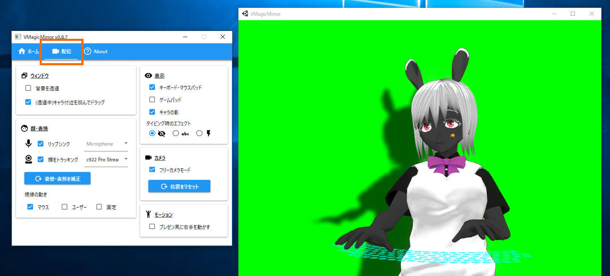](./images/get_started/img00_050_streaming_tab.png){: data-lightbox="img00_050"}

### 2.3.1. ウィンドウ

`ウィンドウ`で、`背景を透過`のチェックをオンにすることで、キャラクター表示ウィンドウの背景を透明にできます。VMagicMirrorは通常、この状態で使用します。

[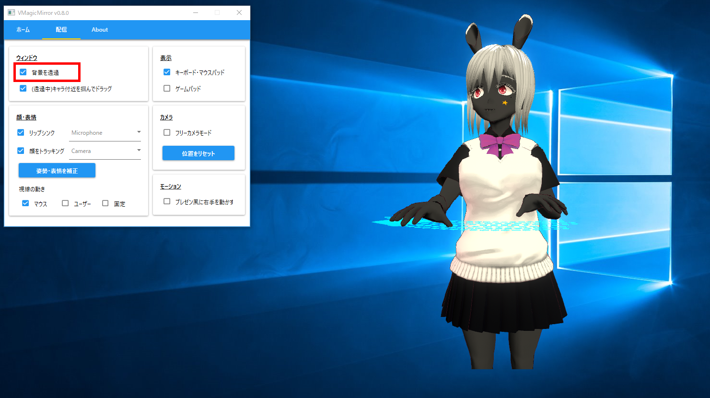](./images/get_started/img00_060_transparent_bg.png){: data-lightbox="img00_060"}

背景を透明にしたとき、`(透過中)キャラ付近を掴んでドラッグ`のチェックがオンになっていれば、キャラクター付近を左クリック+ドラッグしてキャラクターを移動できます。

[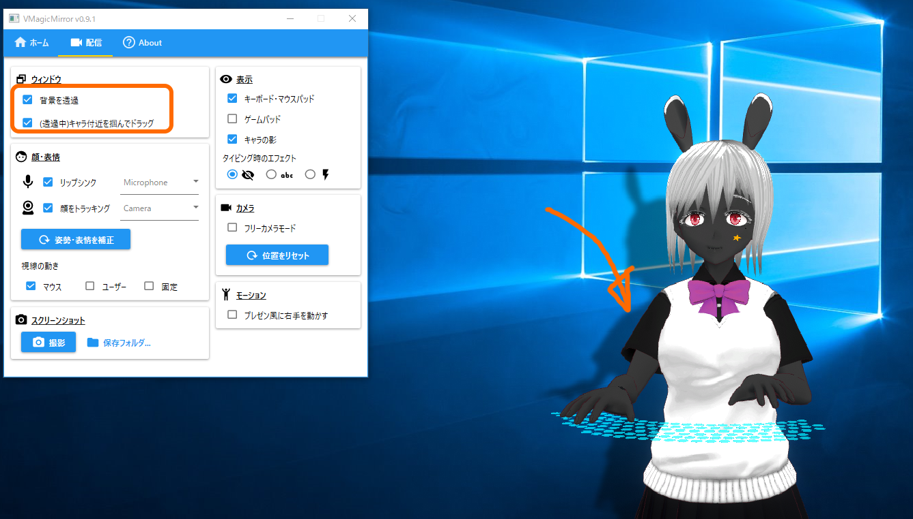](./images/get_started/img00_070_transparent_bg_drag.png){: data-lightbox="img00_070"}

ただし、`(透過中)キャラ付近を掴んでドラッグ`がオンのままだとキャラクターを誤って移動してしまうことがあります。

これを防ぐためには、キャラクターを移動させたあとで`(透過中)キャラ付近を掴んでドラッグ`のチェックをオフにします。

すると、キャラクター表示ウィンドウは全くクリックに反応しなくなり、背後の画面にアクセスできます。

[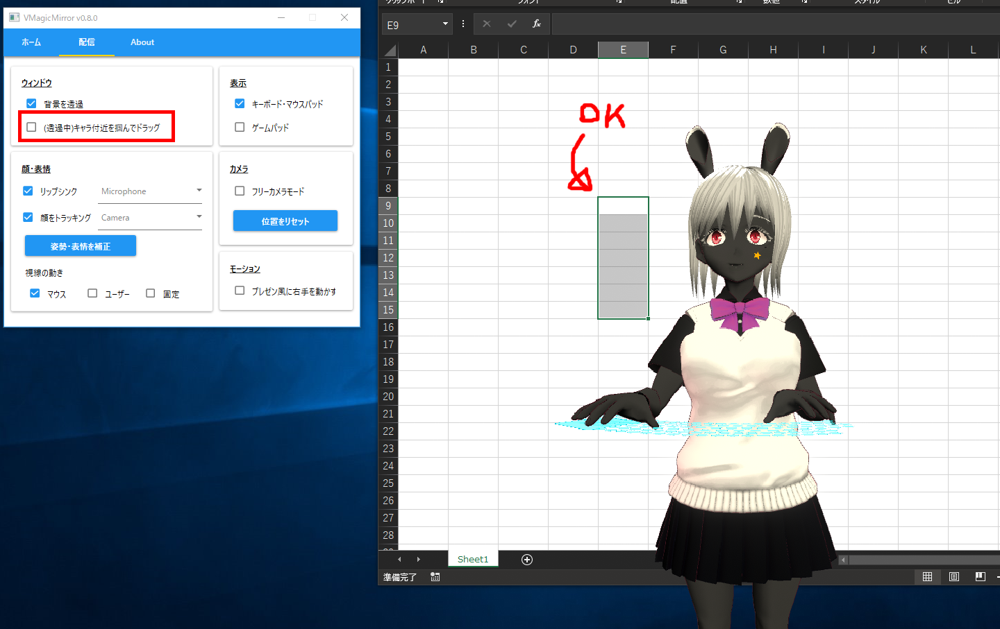](./images/get_started/img00_090_transparent_bg_can_click.png){: data-lightbox="img00_090"}

### 2.3.2. 顔・表情

`顔・表情`メニューは、顔の動きに関連する主要な機能です。

[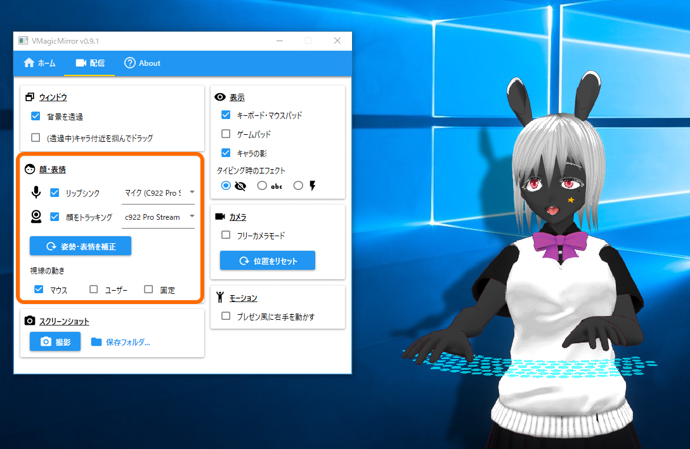](./images/get_started/img00_100_streaming_face.png){: data-lightbox="img00_100"}

#### リップシンク

`リップシンク`はマイクを使用する機能です。このチェックをオンにし、右のマイク一覧から使いたいマイクを選ぶと、リップシンクが有効になります。

#### 顔トラッキング

`顔をトラッキング`ではウェブカメラが必要です。リップシンクと同様に、`顔をトラッキング`のチェックをオンにし、右の一覧からウェブカメラを選ぶことで、顔トラッキングが有効になります。

もしあなたの顔がカメラの正面から上下左右にずれていたり、カメラとの距離が近い、または遠い場合はキャラクターの姿勢がおかしくなるかもしれません。

その場合、普段の姿勢で画面を見ながら`姿勢・表情を補正`ボタンをクリックします。補正に成功すると、キャラクターが中央に戻ります。

**Hint:** v0.9.3かより古いバージョンでキャラクターの目が閉じがちになってしまう場合、目を半閉じにして`姿勢・表情を補正`ボタンをクリックすると、目が開きやすくなります。似たように、キャラクターがうつむきがちになる場合は、少し下を向いて`姿勢・表情を補正`ボタンをクリックすると、キャラが上を向くようになります。

#### 視線の動き

VMagicMirrorの基本設定では、キャラクターがマウスポインタの方向を向きます。

これは作業配信やプレゼンテーションを想定したデフォルト設定ですが、都合によっては他のモードを選ぶこともできます。

* マウス: キャラクターはマウスポインタの方向を向きます。デフォルト設定です。
* ユーザー: キャラクターは常にあなたの方向を向きます。マウスの動きが激しすぎる場合などに使用します。
* 固定: 顔トラッキングのみで首を動かすようにします。動きをおさえたい場合に使用します。

### 2.3.3. Word To Motion

この機能ではキャラクターの表情などをコントロールできます。詳しくは[3: 詳細設定](./about_settings.html)の「3.5. Word to Motion」を参照下さい。

[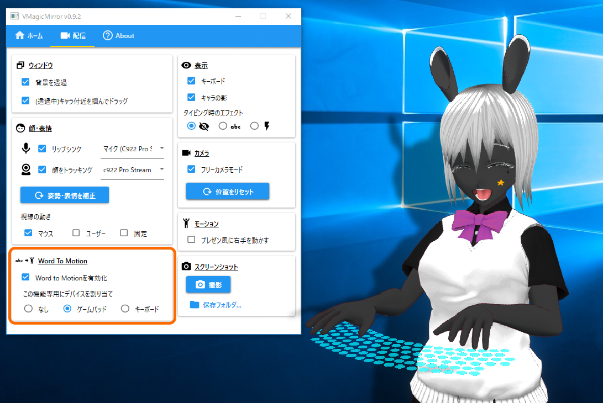](./images/get_started/img00_105_word_to_motion.png){: data-lightbox="img00_105"}

`Word to Motionを有効化`チェックがオンの状態で、以下いずれかを行うと表情を変化させることができます。

* "joy"、"angry"、"sorrow"、"fun"のいずれかの単語をタイピングする。
* `この機能専用にデバイスを割り当て`で`ゲームパッド`を選択し、ゲームパッドのA、B、X、Yボタンを押す。
* `この機能専用にデバイスを割り当て`で`キーボード`を選択し、数字キーの1、2、3、4のいずれかをタイピングする。

**NOTE:** `この機能専用にデバイスを割り当て`で選択したデバイスは通常のモーションとしては反映されなくなります。次のような使い分けを想定しています。

* `なし`を選ぶケース: 配信用途ではなく、単にキャラクターを置いておきたいとき。
    - `なし`にすると、キャラクターの動きと実際のあなたの動きが最も一致します。
* `ゲームパッド`を選ぶケース: 作業画面の配信、共有がしたいとき。
    - キャラクターは常に作業をしている見た目に保ったまま、ゲームパッドで表情が切り替えられます。
* `キーボード`を選ぶケース: ゲームのプレイ画面を配信、共有したいとき。
    - キャラクターは常にゲームをしている見た目に保ったまま、キーボードで表情が切り替えられます。

### 2.3.4. 表示

`表示`で`キーボード`や`キャラの影`のチェックのオン・オフを切り替えることで、これらの要素を表示するか隠すかを選択できます。

[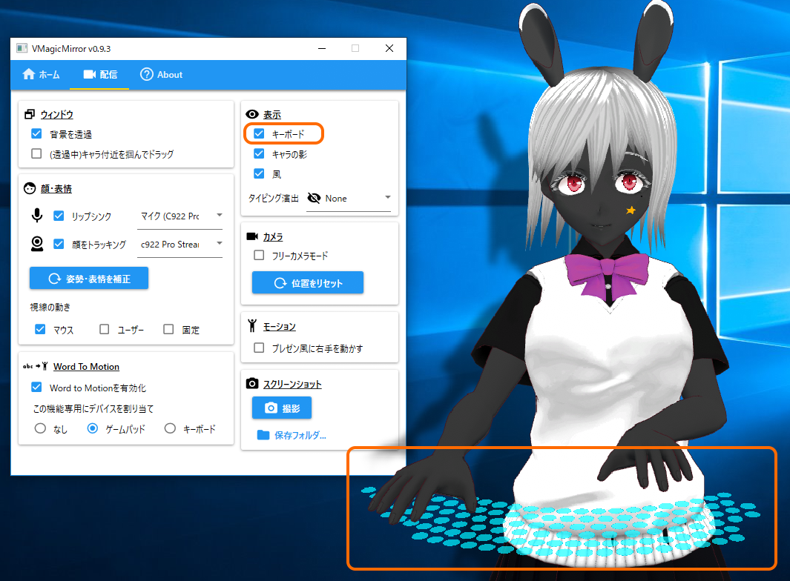](./images/get_started/img00_110_view_keyboard_visible.png){: data-lightbox="img00_110"}

[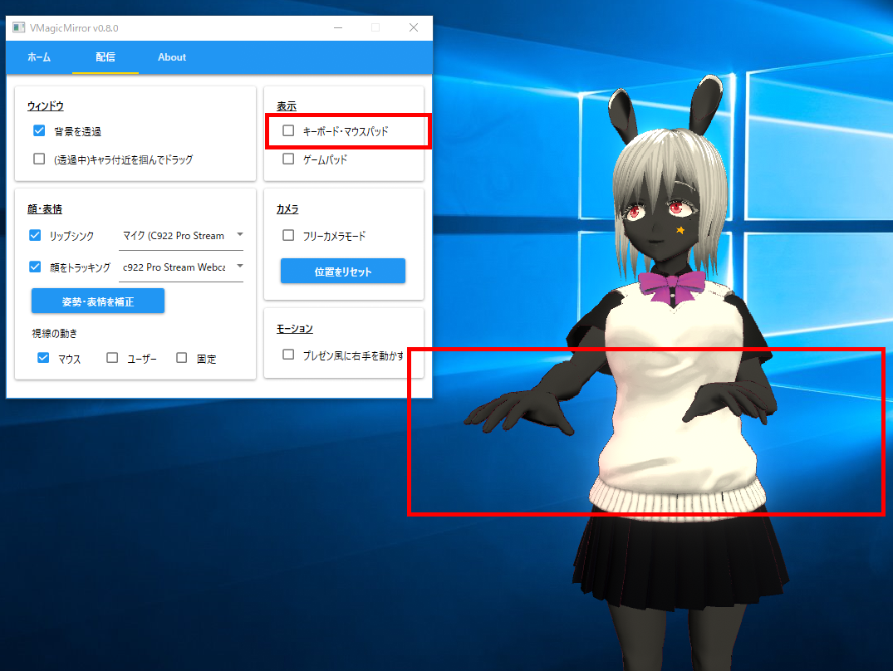](./images/get_started/img00_120_view_keyboard_hidden.png){: data-lightbox="img00_120"}

※v0.9.0～v0.9.4ではゲームパッドはつねに非表示となります。

**Hint:** 影の見栄えがあまり良くない場合、[4: トラブルシューティング](./troubleshooting.html)の"4.9. 影が綺麗に映らない"をご確認下さい。どうしても見栄えが改善しない場合、影の表示をオフにして下さい。

また、キーボードを表示した状態で`タイピング時のエフェクト`を中央の「テキスト」または右の「ライト」に指定することで、タイピングにあわせた演出も表示されるようになります

[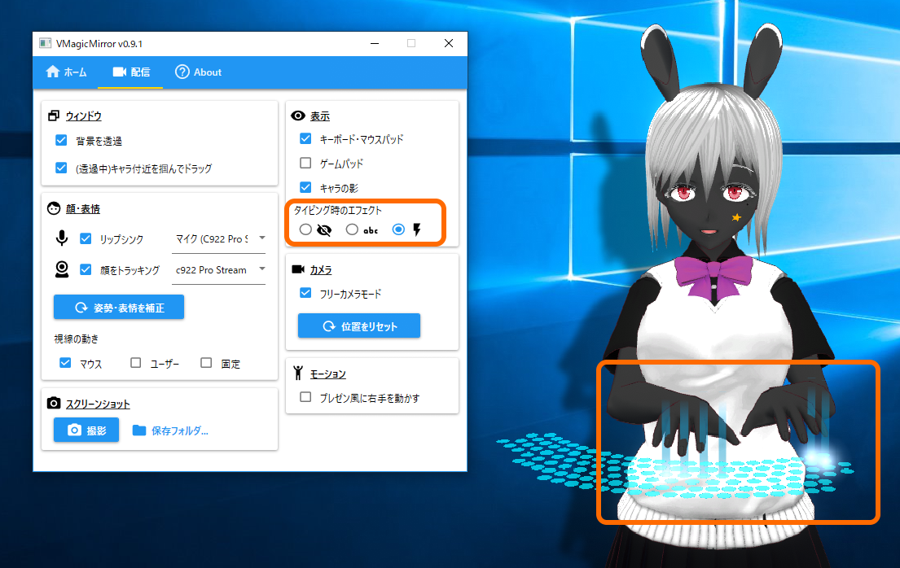](./images/get_started/img00_125_view_typing_effect_example.png){: data-lightbox="img00_125"}

### 2.3.5. カメラ

`フリーカメラモード`を用いるとカメラの視点を変更し、自由な方向からキャラクターを見られます。

本機能を使うときは、いったん`ウィンドウ`メニューの`背景を透過`をオフにします。

`フリーカメラモード`のチェックをオンにし、キャラクター表示ウィンドウを左クリックしてアクティブにします。

キャラクター表示ウィンドウがアクティブな間、いくつかの方法で視点を動かせます。

* 右クリック + ドラッグ : 視線を上下左右に回転
* 中クリック + ドラッグ : カメラを上下左右に平行移動
* 中ホイール : カメラを前後に移動

[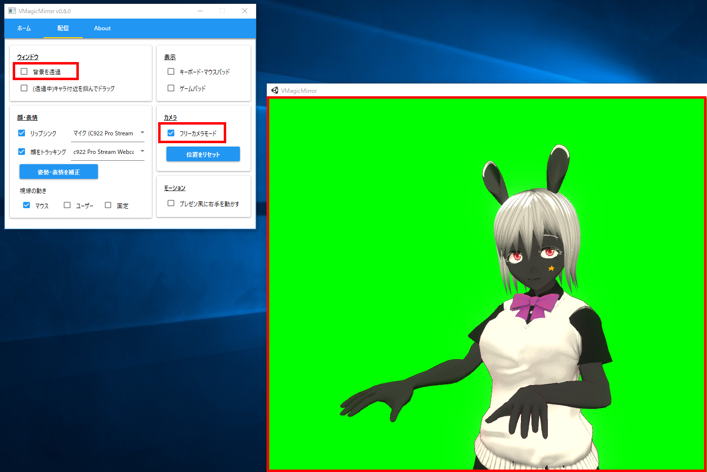](./images/get_started/img00_130_free_camera_mode.png){: data-lightbox="img00_130"}

キャラクターを見失った場合や、始めからやり直したい場合は、`位置をリセット`ボタンで初期状態に戻せます。

調整が終わったら`背景を透過`をふたたびオンにします。

また、`フリーカメラモード`も有効なままにすると誤ってカメラを動かしてしまう場合があるため、`フリーカメラモード`のチェックもオフにしておきます。

{: data-lightbox="img00_140"}

**Hint:** 操作に慣れてきたら、`背景を透過`をオンにしたままでも`フリーカメラモード`を使えます。

* `(透過中)キャラ付近を掴んでドラッグ`をオンにする
* キャラクターを左クリックする
* 右クリック、中クリック、ホイールで視点を調整
* キャラクターを動かしたくない場合、調整が終わりしだい`(透過中)キャラ付近を掴んでドラッグ`をオフにする

※`背景を透過`をオンにしたまま`フリーカメラモード`を用いると、気づかないうちにキャラクターがキャラクター表示ウィンドウから見切れることがあります。キャラクターが見切れてよく分からなくなってしまった場合は`位置をリセット`ボタンを押してやり直すか、`背景を透過`をオフにしてウィンドウの位置を確認します。

v0.9.4からは視点のクイックセーブ/ロード機能が追加されています。

`フリーカメラモード`で視点を決めたのち`クイックセーブ`の`[1], [2], [3]`いずれかのボタンを押すと、視点を保存できます。保存された視点を`クイックロード`の対応するボタンでロードできます。

[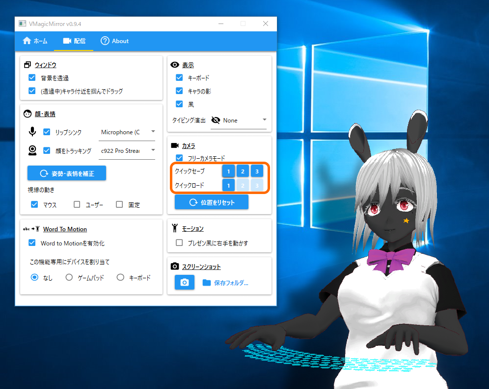](./images/get_started/img00_135_camera_quick_save.png){: data-lightbox="img00_135"}

### 2.3.6. デバイスのレイアウト

この機能はv0.9.5から追加されました。

`フリーレイアウトモード`のチェックをオンにするとキーボード、タッチパッド、ゲームコントローラの位置を調整できます。

[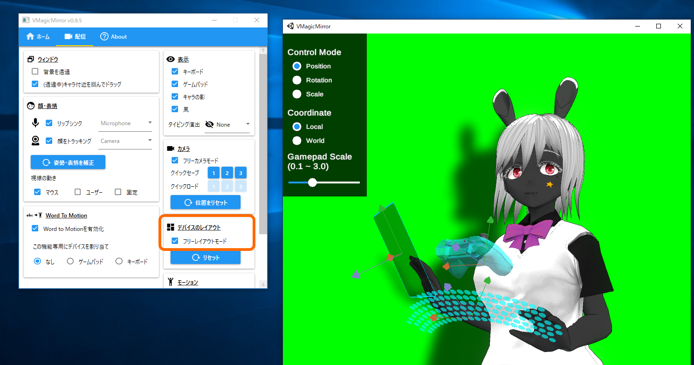](./images/get_started/img00_200_free_layout.png){: data-lightbox="img00_200"}

調整を行うときは`背景を透過`がオフになります。

画面左上の設定は次のような意味です。

* Control Mode: デバイスの位置、回転、スケールのどれを調整するかを選択します。
* Coordinate: デバイスに沿った座標で動かすか、ワールド座標を用いるかを選択します。よく分からない場合、`Local`のままで操作してください。
* Gamepad Scale: ゲームパッドのモデル部分の大きさを調整します。ゲームパッドが明らかに手から突き抜けてしまう場合、ここで値を小さくします。

レイアウトが極端に崩れてしまった場合、`リセット`で標準的なレイアウトに戻せます。

### 2.3.7. モーション

`プレゼン風に右手を動かす`のチェックをオンにしてマウスを動かすと、キャラクターが右手でマウスポインタの方向を指し示します。

{: data-lightbox="img00_150"}

このスタイルは解説動画やプレゼンテーションでVMagicMirrorを使うときに有効です。

このモードを終了するときは`プレゼン風に右手を動かす`のチェックをオフにします。

**Hint:** 詳しくは[Tips B: プレゼンテーションでVMagicMirrorを使う](./tips_presentation.html)もあわせてご覧下さい。

### 2.3.8. スクリーンショット

[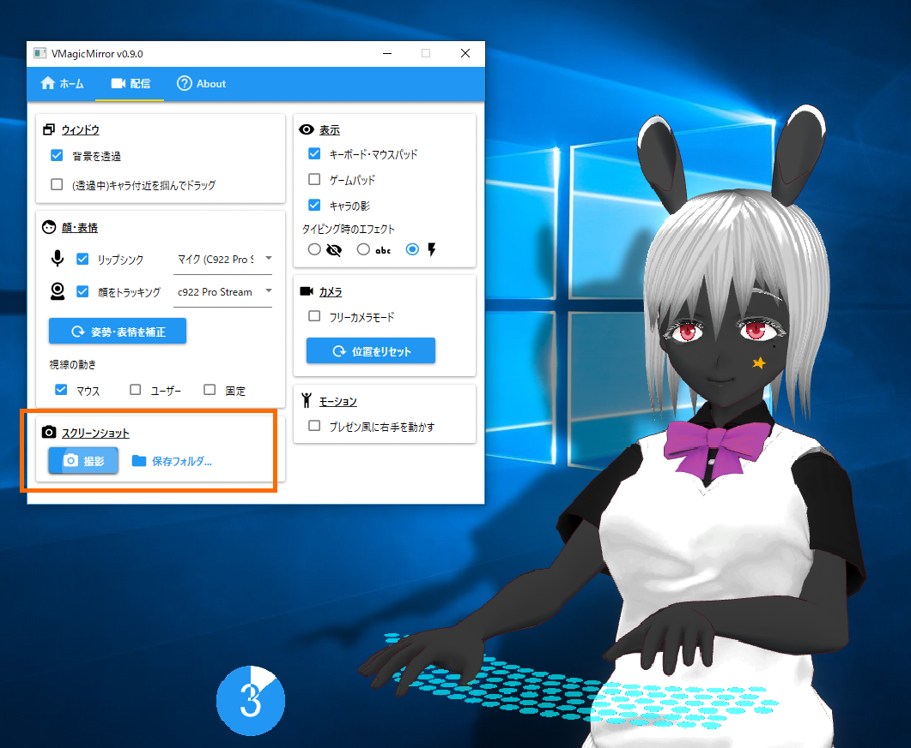](./images/get_started/img00_180_screenshot.png){: data-lightbox="img00_180"}

`撮影`ボタンを押すと3秒間のカウントダウンののち、スクリーンショットを撮影します。

スクリーンショットの保存先は`VMagicMirror.exe`があるフォルダの`Screenshots`フォルダです。(スクリーンショットを1枚も撮った事が無い場合、フォルダが存在しないことがあります)

スクリーンショットは透過画像で、影の表示/非表示も反映されるため、影ごと他の画像と合成することができます。

[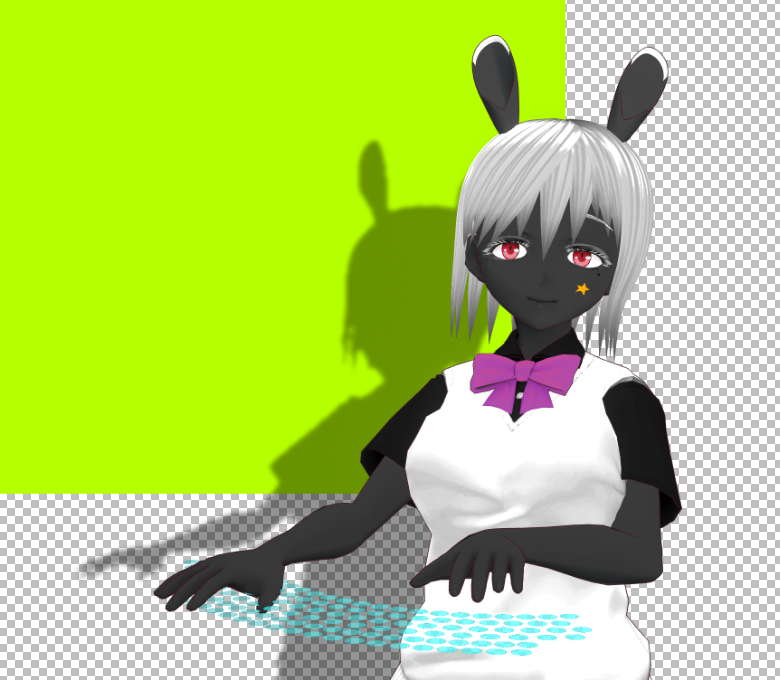](./images/get_started/img00_190_screenshot_shadow.png){: data-lightbox="img00_190"}

## 2.4. もっと細かく調整したい方へ

ここまで動かしてみて、見た目に気になる点があった方もいると思います。

* キーボードの位置がキャラクターに比べて高すぎ・低すぎ
* キャラクターが明るすぎる・暗すぎる

[3: 詳細設定](./about_settings.html)ではこれらの問題を解決できます。

個々のキャラクターにあわせてしっかりと調整したい方はこちらもお読みください。

## Sections

* [1: VMagicMirrorについて](./index.html)
* 2: 基本的な使い方 (このページ)
* [3: 詳細設定](./about_settings.html)
* [4: トラブルシューティング](./troubleshooting.html)
* [Tips A: デスクトップマスコット化のための設定](./tips_desktop_mascot.html)
* [Tips B: プレゼンテーションでVMagicMirrorを使う](./tips_presentation.html)
* [Tips C: 前バージョン(v0.8.0以降)の設定を引き継ぐ](./tips_load_prev_setting.html)
* [Tips D: キーボードやタッチパッドの見た目を変更する](./tips_change_textures.html)
* [License](./about_license.html)
* [Change Log](./changelog.html)
* [FAQ](./en_frequently_asked_questions.html)
